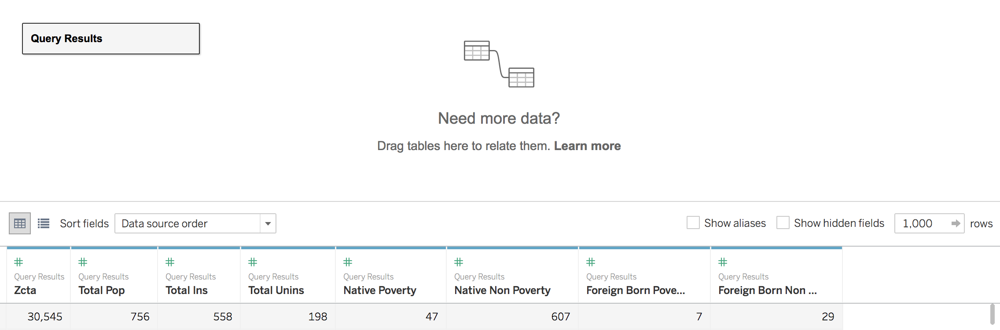

# dsc-etl-cumulative-lab-part-c-tableau-setup

## Introduction
You've completed the SQL query from Part B of the ETL cumulative lab.  Nice work!  

Now we're going to import that data into Tableau, and join it to an additional dataset.  

You'll get practice with loading data from tool to tool, loading multiple types of data into Tableau, and with joins.

The steps of this lab will prepare you for doing the project at the end of the Phase, so you are *highly* encouraged to complete it!

## Objectives
You will be able to:

- Import the data pulled from the SQL query written in `data.world` (from Part B of the ETL cumulative lab) into Tableau

- Within Tableau, import and join an additional `.csv` file containing data which augments the SQL query data

## Your Task:

### Data Understanding

Recall from Parts A and B of the ETL cumulative lab a few key aspects of this data:

- Each row is a **zip code tabulation area**, or `zcta`.  The US Census Bureau breaks US geography down into different sub-units.  A small unit, called a block, is rolled up into a larger unit that maps roughly (but not precisely) onto USPS zip codes.  The US Census unit which contains multiple blocks is a `zcta`. 
    - Again, **zip code tabulation area** used by the US Census does *not* map 1:1 onto **zip codes** used by the USPS to deliver mail, but they are relatively close

-  The variables in each row from `Health Insurance` and `Poverty` are counts of people who contain specific `Health Insurance` and `Poverty` characteristics within a given `zcta`.  

### Requirements

#### 1. Import `data.world` SQL query into Tableau 

Copy the link for the SQL query you created in Part B of the ETL cumulative lab, and use that link to connect Tableau to the data you pulled.  

#### 2. Import state data from `zcta_fips.csv` and join to `data.world` data

Import an additional file `zcta_fips.csv` provided in this repo and join with the data pulled from `data.world`.  This will augment the `data.world` data with the US state containing each `zcta`.

#### 3. Decide the keys and join type 

To complete the join, determine the keys the join will occur on for both tables, as well as the type of join

## Set up requirements

From previous lessons, you should have already:
- free accounts set up with `data.world` and `Tableau Public` 
- the Tableau Public software downloaded onto your local machine

If you don't, follow the instructions HERE to get them set up.

## Import `data.world` SQL query into Tableau 

>Copy the link for the SQL pull you created in Part B of the ETL cumulative lab, and use that link to connect Tableau to the data you pulled.  

This will take several steps, and some of the machinery has been provided for you below.

### In `data.world`, copy the link for the SQL pull

Go to the **`Project`** you created in your `data.world` account for Part B of the ETL cumulative lab.

Go to the **`SQL Query`** you created.

When looking at the SQL query, right below the query is a `Connect to Tableau` button.  

**Note**: if you are looking at your SQL pull and you don't see that button, you might not have set up the `Tableau` capability within `data.world`. See the [**Set up requirements**](##Set-up-requirements) section for instructions on how to set up the `Tableau` capability within `data.world`.

Clicking that brings up a box with a "link to the sql pull" which we will copy and paste into the correct spot in Tableau to connect to the data.

**Note**: this is allowing us to connect to the dataset without having to download it locally!

Click the `Copy` button to load the "link to the sql pull" into the clipboard

### Use the link you just copied to connect Tableau to the data you pulled

Go to Tableau and click on the "Web Data Connector" link on the left-hand side of the start screen, under "Connect [. . .] To a Server"

This will bring up a box where you will paste the "link to the sql pull" you previously copied

Hit `return`, and then click the `Connect` button!

(It may ask you for your `data.world` password before showing you the screen below with the `Connect` button)

After taking a bit to load the data, `Tableau` should open up a screen showing you a view of the data.  

If the data isn't currently shown, click the `Update` button in the grey field where the data is displayed.

**Note**: You should have the same `columns` as the data visible in the picture above, but if you have different data values, that's ok.  

## Import state data from `zcta_fips.csv` and join to `data.world` data
>Import an additional file `zcta_fips.csv` provided in this repo and join with the data pulled from `data.world`.  This will augment the `data.world` data with the US state containing each ZCTA.

As we can see from the screenshot above, we have currently pulled data from each Zip Code Tabulation Area (ZCTA) containing total counts for several categories of variables in `Health Insurance` and `Poverty`.  

However, we don't currently have any data about the `State` in which a given `ZCTA` resides.

Luckily, such a dataset is in this repo!  

The ACS uses something called a `FIPS` code to refer to state-level geography.

`zcta_fips.csv` in the `data` directory contains a couple columns to map each `ZCTA` to the name of the state it is in via a `FIPS` code:

- `ZCTA5`, which contains each `ZCTA` code used in the 2011-2015 American Community Survey
- `FIPS`, which contains the `FIPS` code unique to each state
- `STUSAB`, which is the state abbreviation for that `FIPS` code
- `STATE_NAME`, which is the full, unabbreviated state name for each `ZCTA` code.  

#### Checking for Understanding

Take a quick second and consider: why do we want a column that, in every row, provides the `State` which contains the `ZCTA` for that row?

.

.

.

*Answer: We want to be able to display data aggregated by state.  In order to do so, we have to know which state every `ZCTA` is in so that we know which rows to combine for which states.

#### Importing `zcta_fips`.csv
To add that data to our dataset, we're going to `add` that dataset and then `join` it with the queried data we've already loaded.

To do so, download `zcta_fips.csv` onto your local machine.

Click on `add` in the upper right, accross from **Connections**

At this screen, you should click `Text file`, since the file we want to load is a `.csv`

**Note**: the specific options here only allow selections of specific file types, so if you click on something else, like `Microsoft Excel`, you will not be able to open our `.csv` file.

You should now have the following view in the upper left portion of the screen, which contains both the data from the SQL pull and the state information to add from the csv

**Note**: if you have added local files to Tableau previously, they might also show up in the area where `zcta_fips.csv` is in the above picture.  In that case, you will have more than one file available.  That's ok!  Just confirm that `zcta_fips.csv` is in the list there somewhere.  

Double-click the `Query Results` box to get this view, where we can manipulate `Query Results`, including adding joins to it.

Drag the `zcta_fips.csv` file from the left-hand column over into the `Query Results` box.  The box should highlight orange as you drag the file over to it, and after dragging you should be seeing this view:

Now you have some decisions to make!

## Deciding the keys and join type

>To complete the join, determine the keys the join will occur on for both tables, as well as the type of join

### Decide which keys will be used for each table for the join

The blank area below `Data Source`, and the blank area below `zcta_fips.csv`, are the places where the keys for the respective tables are chosen. (`Data Source` refers to the data pulled from the `data.world` SQL query.)

It is now up to you to determine the keys we're using to join these two tables.

Keep the following in mind: 

- The keys should be columns **in common** between the two tables, so that the other columns that are unique to each table can be "joined" together through a common link.

- Don't be fooled by different names on the columns!  What matters is the **actual data** that's in the column.

### Determine the type of join

To select the type of join, click on one of the overlapping circles, helpfully labeled `inner`, `left`, `right` and `full outer`.

Keep the following in mind:

- An `inner` join should be used when we're confident that *only keys showing up in both tables* should have their rows returned

- An `left` (or `right`) join should be used when we're confident that *all keys showing up in the `left` (or `right`) table* should have their rows returned, and that whatever of those keys also happen to show up in the other table should have that other table's information added.

- An 'outer' join should be used when we want all rows returned from both tables

#__SOLUTION__

